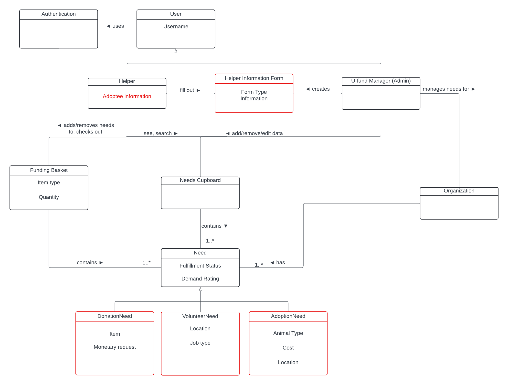

# PROJECT Design Documentation

> _The following template provides the headings for your Design
> Documentation.  As you edit each section make sure you remove these
> commentary 'blockquotes'; the lines that start with a > character
> and appear in the generated PDF in italics but do so only **after** all team members agree that the requirements for that section and current Sprint have been met. **Do not** delete future Sprint expectations._

## Team Information
* Team name: HalfCourt
* Team members
  * Jonah Witte
  * Kayla Van Bortel
  * Max Klot
  * Ryan Richter

## Executive Summary

This is a summary of the project.

### Purpose
>  _**[Sprint 2 & 4]**
> The purpose of our U-fund application is to allow philanthropists to be able to fund the NYS Paws & Claws foundation,
and for administrators of the NYS Paws & Claws Foundation to be able to manage the application.

### Glossary and Acronyms
> _**[Sprint 2 & 4]** Provide a table of terms and acronyms._

| Term | Definition |
|------|------------|
| SPA | Single Page |

## Requirements

This section describes the features of the application.

> _In this section you do not need to be exhaustive and list every
> story.  Focus on top-level features from the Vision document and
> maybe Epics and critical Stories._

### Definition of MVP
> _**[Sprint 2 & 4]**
>
> In our Minimum Viable Product in Sprint 2, the user is first routed to a login page. If they enter an unrecognized username, a new account is created for them and they are then sent to the home page. If they enter a
> username that already exists, they are logged in and sent to the home page. If they enter "admin", they are sent a modified "admin" version of the home page. On the home page, you can see a list of needs in the needs
> cupboard. If you are a helper, you are able to view needs, add needs to your basket, and checkout. As an admin, you are able to modify needs, post new needs, and delete needs. 

### MVP Features
>  _**[Sprint 4]** Provide a list of top-level Epics and/or Stories of the MVP._

### Enhancements
> _**[Sprint 4]** Describe what enhancements you have implemented for the project._

## Application Domain

This section describes the application domain.

> _**[Sprint 2 & 4]** Provide a high-level overview of the domain for this application. You
> can discuss the more important domain entities and their relationship
> to each other._

## Architecture and Design

This section describes the application architecture.

### Summary

The following Tiers/Layers model shows a high-level view of the webapp's architecture. 
**NOTE**: detailed diagrams are required in later sections of this document.

The web application, is built using the Model–View–ViewModel (MVVM) architecture pattern. 

The Model stores the application data objects including any functionality to provide persistance. 

The View is the client-side SPA built with Angular utilizing HTML, CSS and TypeScript. The ViewModel provides RESTful APIs to the client (View) as well as any logic required to manipulate the data objects from the Model.

Both the ViewModel and Model are built using Java and Spring Framework. Details of the components within these tiers are supplied below.

### Overview of User Interface

This section describes the web interface flow; this is how the user views and interacts with the web application.

> _Provide a summary of the application's user interface.  Describe, from the user's perspective, the flow of the pages in the web application._

### View Tier
> _**[Sprint 4]** Provide a summary of the View Tier UI of your architecture.
> Describe the types of components in the tier and describe their
> responsibilities.  This should be a narrative description, i.e. it has
> a flow or "story line" that the reader can follow._

> _**[Sprint 4]** You must  provide at least **2 sequence diagrams** as is relevant to a particular aspects 
> of the design that you are describing.  (**For example**, in a shopping experience application you might create a 
> sequence diagram of a customer searching for an item and adding to their cart.)
> As these can span multiple tiers, be sure to include an relevant HTTP requests from the client-side to the server-side 
> to help illustrate the end-to-end flow._

> _**[Sprint 4]** To adequately show your system, you will need to present the **class diagrams** where relevant in your design. Some additional tips:_
 >* _Class diagrams only apply to the **ViewModel** and **Model** Tier_
>* _A single class diagram of the entire system will not be effective. You may start with one, but will be need to break it down into smaller sections to account for requirements of each of the Tier static models below._
 >* _Correct labeling of relationships with proper notation for the relationship type, multiplicities, and navigation information will be important._
 >* _Include other details such as attributes and method signatures that you think are needed to support the level of detail in your discussion._

### ViewModel Tier
> **[Sprint 1]** 

The main class for our ViewModel implementation is our NeedsController class. This class serves to interact with the NeedDAO interface.

> _**[Sprint 4]** Provide a summary of this tier of your architecture. This
> section will follow the same instructions that are given for the View
> Tier above._

> _At appropriate places as part of this narrative provide **one** or more updated and **properly labeled**
> static models (UML class diagrams) with some details such as associations (connections) between classes, and critical attributes and methods. (**Be sure** to revisit the Static **UML Review Sheet** to ensure your class diagrams are using correct format and syntax.)_
> 

### Model Tier
> **[Sprint 1]**
>
> The abstract class for our Model Tier implementation is our Need class. It has generalized members and functions including name, id and fullfillment status.
>
> Our DonationNeed class inherits from our Need class. Our DonationNeed class has specialized members and functions such as cost and it's getter and setter methods.   

> _**[Sprint 2, 3 & 4]** Provide a summary of this tier of your architecture. This
> section will follow the same instructions that are given for the View
> Tier above._
>
> In Sprint 2, we decided to implement three new classes within our model tier, the Account and Basket and BasketNeed classes. The Account class represents an account, which has a name and a basket of needs. The basket of needs contains an arraylist of basketneeds, which are object representations of needs that stay inside a user's basket. 

> _At appropriate places as part of this narrative provide **one** or more updated and **properly labeled**
> static models (UML class diagrams) with some details such as associations (connections) between classes, and critical attributes and methods. (**Be sure** to revisit the Static **UML Review Sheet** to ensure your class diagrams are using correct format and syntax.)_
> 

## OO Design Principles

> **[Sprint 1]**

Single Responsibility: Each module should have one tightly focused responsibility.

Open-Close: When modifying a module, you should not make changes to existing logic, but rather consider keeping it and creating new logic instead. 

### The Single Responsibility
A class is considered to comply with the single responsibility principle if there is one and only one reason for the class to change. One “thing” is not necessarily well defined, but it refers to one group of related behaviors and states. 
	For example, The DonationNeed fails to comply with this principle. If there is ever a change to a donation item – for example an item needs to store a cost or quantity – the DonationNeed class will need to be updated. This update will either be added state and behavior to DonationNeed (bad), or by replacing the donation items list (of strings) with a list of some DonationItem objects. The second option is preferred because it forces DonationNeed to become singularly responsible again, but this responsibility should be separated from the start. 
	While the 3 Need specializations are currency only responsible for one thing, that is only because the 2nd thing they are “responsible” for does not do anything. Therefore the mantra that single responsibility is based on things that may change, is what makes these needs fail to comply with the single responsibility principle. 

NeedController: Only responsible for updating and fetching needs
NeedDAO: Only responsible for DAO processes related to Needs
NeedFileDAO: Same as NeedDAO but specialized
Need: Only needs to be updated if the structure of a need changes
DonationNeed: **FAILS TO COMPLY**: DonationNeed needs to change if either 1) donation items change or 2) the donation process changes. 
SOLUTION: Make a DonationItem class so that other information or behavior. Right now that would just be a string but in the future an item may have a cost
VolunteerNeed: **FAILS TO COMPLY**: Changes to volunteer state/behavior OR the volunteer process requires a change to this class
AdoptionNeed: **FAILS TO COMPLY**: Changes to animalType state/behavior OR changes to the adoption process requires changes to the AdoptionNeed class

### Open/Closed
A class should be open to expansion but closed to modification. Expansion means that different components can be used in a class but the behavior of the class does not change. A good example of this is the NeedDAO, which does not need to be modified to add more behavior. Instead, we inherit NeedDAO and create a new object (NeedFileDao) which is an extension. 

Our DonationNeed class does not comply with this principle. To add new behavior to a DonationNeed, we must change the items array. For example, adding a cost to each specific item would require us to make a new class (DonationItem) and modify DonationNeed to support this new class. We would also have to modify our methods and fields for storing the cost of a DonationNeed since it is now variable depending on the items in the need. 
	If we abstract this state and behavior, then we can update the Item by adding methods or state rather than modifying the existing methods and state in DonationNeed. 

Open/Closed is useful for maintaining backwards compatibility. By not modifying existing code, you minimize the chance of breaking old code. Instead you can build new independent functionality on top of the existing code. While the old code can run with what is now a limited feature set, the new code, which depends on new features, is also able to run - removing the need to refactor large parts of code (which depends on the thing being changed) when adding features. 

> _**[Sprint 2, 3 & 4]** Will eventually address upto **4 key OO Principles** in your final design. Follow guidance in augmenting those completed in previous Sprints as indicated to you by instructor. Be sure to include any diagrams (or clearly refer to ones elsewhere in your Tier sections above) to support your claims._

> _**[Sprint 3 & 4]** OO Design Principles should span across **all tiers.**_

## Static Code Analysis/Future Design Improvements
> _**[Sprint 4]** With the results from the Static Code Analysis exercise, 
> **Identify 3-4** areas within your code that have been flagged by the Static Code 
> Analysis Tool (SonarQube) and provide your analysis and recommendations.  
> Include any relevant screenshot(s) with each area._

> _**[Sprint 4]** Discuss **future** refactoring and other design improvements your team would explore if the team had additional time._

## Testing
> _This section will provide information about the testing performed
> and the results of the testing._

### Acceptance Testing
> _**[Sprint 2 & 4]** Report on the number of user stories that have passed all their
> acceptance criteria tests, the number that have some acceptance
> criteria tests failing, and the number of user stories that
> have not had any testing yet. Highlight the issues found during
> acceptance testing and if there are any concerns._

### Unit Testing and Code Coverage
> _**[Sprint 4]** Discuss your unit testing strategy. Report on the code coverage
> achieved from unit testing of the code base. Discuss the team's
> coverage targets, why you selected those values, and how well your
> code coverage met your targets._

>_**[Sprint 2, 3 & 4]** **Include images of your code coverage report.** If there are any anomalies, discuss
> those._

## Ongoing Rationale
>_**[Sprint 1, 2, 3 & 4]** Throughout the project, provide a time stamp **(yyyy/mm/dd): Sprint # and description** of any _**major**_ team decisions or design milestones/changes and corresponding justification._
>
> **[Sprint 1] (2024/10/1) decisions**
> - Switched from integer IDs or unique names for Needs to String UUIDs. This change was agreed upon to simplify the backend logic and limit conflicts based on hidden backend information.
> - Decided to keep our DAO as Need/NeedFile rather than Cupboard, as the Cupboard name is a concept for the customer and holds no signficance to working with the Need classes on the backend.
>
> > **[Sprint 2] (2024/10/24) decisions**
> > - Needs displayed on the frontend are always sorted in descending demand order, unless otherwise sorted by a user.
> > - Demand Rating has precision to the tenth
