# PROJECT Design Documentation

> _The following template provides the headings for your Design
> Documentation.  As you edit each section make sure you remove these
> commentary 'blockquotes'; the lines that start with a > character
> and appear in the generated PDF in italics but do so only **after** all team members agree that the requirements for that section and current Sprint have been met. **Do not** delete future Sprint expectations._

## Team Information
* Team name: HalfCourt
* Team members
  * Jonah Witte
  * Kayla Van Bortel
  * Max Klot
  * Ryan Richter

## Executive Summary

The New York State Paws & Claws U-Fund is an application that encourages Helpers to donate money towards supporting animals. They do this by checking out Needs, such as a donation that goes towards a bag of dog food, and fund them through their basket. Helpers are incentivized by a leveling and badge-earning system and can connect with each other by filling out their profile and viewing others'. Managers can add, edit, and delete the Needs from the cupboard, and are also able to view statistics from Helpers' profiles to see which audiences to market more towards.

### Purpose
>  _**[Sprint 2 & 4]**
> The purpose of our U-Fund application is to allow philanthropists to be able to fund the NYS Paws & Claws foundation, and for administrators of the NYS Paws & Claws Foundation to be able to manage the application.

### Glossary and Acronyms
> _**[Sprint 2 & 4]** Provide a table of terms and acronyms._

| Term | Definition |
|------|------------|
| SPA | Single Page |
| HTML | HyperText Markup Language |
| CSS | Cascading Style Sheets |
| API | Application Programming Interface |
| DAO | Data Access Object |
| ID | Identifier |
| UUID | Universally Unique Identifier |
| REST | Representational State Transfer |
| OO | Object-Oriented |
| rank | A helper's position on the leaderboard (rank 1 is best) |
| level | Status based on donations made (higher level = better) |

## Requirements

This section describes the features of the application.

> _In this section you do not need to be exhaustive and list every
> story.  Focus on top-level features from the Vision document and
> maybe Epics and critical Stories._

### Definition of MVP
> _**[Sprint 2 & 4]**
>
> In our Minimum Viable Product in Sprint 2, the user is first routed to a login page. If they enter an unrecognized username, a new account is created for them and they are then sent to the home page. If they enter a
> username that already exists, they are logged in and sent to the home page. If they enter "admin", they are sent a modified "admin" version of the home page. On the home page, you can see a list of needs in the needs
> cupboard. If you are a helper, you are able to view needs, add needs to your basket, and checkout. As an admin, you are able to modify needs, post new needs, and delete needs. 

### MVP Features
>  _**[Sprint 4]** Provide a list of top-level Epics and/or Stories of the MVP._

### Enhancements
> _**[Sprint 4]** Describe what enhancements you have implemented for the project._

## Application Domain

This section describes the application domain.

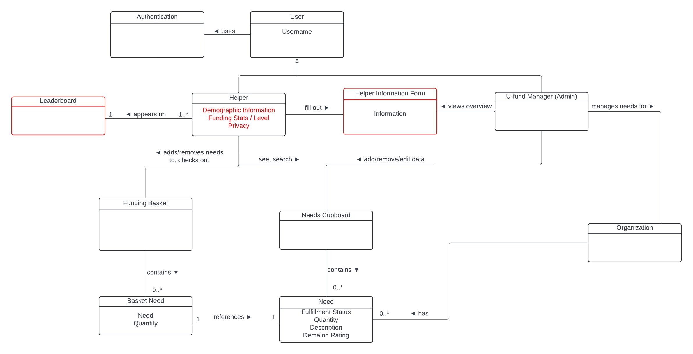

> _**[Sprint 2 & 4]** Provide a high-level overview of the domain for this application. You
> can discuss the more important domain entities and their relationship
> to each other._

The domain for this application is a New York State based wildlife and animal conservation/refuge organization called NYS Paws and Claws. The application will have:

-Helpers

-Admin

-Needs

-Cupboard

-Baskets

A Helper adds needs to the basket.
An Admin edits needs in the cupboard.
A Need goes in the cupboard and a basket.
A Helper has a basket. 

## Architecture and Design

This section describes the application architecture.

### Summary

The following Tiers/Layers model shows a high-level view of the webapp's architecture. 
**NOTE**: detailed diagrams are required in later sections of this document.

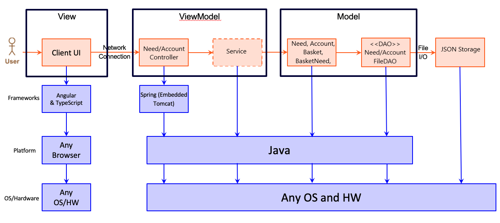

The web application, is built using the Model–View–ViewModel (MVVM) architecture pattern. 

The Model stores the application data objects including any functionality to provide persistance. 

The View is the client-side SPA built with Angular utilizing HTML, CSS and TypeScript. The ViewModel provides RESTful APIs to the client (View) as well as any logic required to manipulate the data objects from the Model.

Both the ViewModel and Model are built using Java and Spring Framework. Details of the components within these tiers are supplied below.

### Overview of User Interface

This section describes the web interface flow; this is how the user views and interacts with the web application.

On page load, a user is met with a login page, prompting them to enter a username. After entering a username, their username is saved to the application (if not admin), and a new account is created for the user. 
Then, a user is redirected to the cupboard page, where they can search, select, and add needs to their basket. They can also access their basket with a button, where they can edit quantities of needs within their basket. If a user logs in as admin, they are able to edit the needs cupboard and cannot view the funding basket. If at any time a user refreshes their page, their authentication is lost and they will have to sign in again. 

### View Tier
> _**[Sprint 4]** Provide a summary of the View Tier UI of your architecture.
> Describe the types of components in the tier and describe their
> responsibilities.  This should be a narrative description, i.e. it has
> a flow or "story line" that the reader can follow._
. 
> _**[Sprint 4]** You must  provide at least **2 sequence diagrams** as is relevant to a particular aspects 
> of the design that you are describing.  (**For example**, in a shopping experience application you might create a 
> sequence diagram of a customer searching for an item and adding to their cart.)
> As these can span multiple tiers, be sure to include an relevant HTTP requests from the client-side to the server-side 
> to help illustrate the end-to-end flow._

> _**[Sprint 4]** To adequately show your system, you will need to present the **class diagrams** where relevant in your design. Some additional tips:_
 >* _Class diagrams only apply to the **ViewModel** and **Model** Tier_
>* _A single class diagram of the entire system will not be effective. You may start with one, but will be need to break it down into smaller sections to account for requirements of each of the Tier static models below._
 >* _Correct labeling of relationships with proper notation for the relationship type, multiplicities, and navigation information will be important._
 >* _Include other details such as attributes and method signatures that you think are needed to support the level of detail in your discussion._

### ViewModel Tier
> **[Sprint 1]** 

The main class for our ViewModel implementation is our NeedsController class. This class serves to interact with the NeedDAO interface.

> _**[Sprint 4]** Provide a summary of this tier of your architecture. This
> section will follow the same instructions that are given for the View
> Tier above._

> _At appropriate places as part of this narrative provide **one** or more updated and **properly labeled**
> static models (UML class diagrams) with some details such as associations (connections) between classes, and critical attributes and methods. (**Be sure** to revisit the Static **UML Review Sheet** to ensure your class diagrams are using correct format and syntax.)_
> 

### Model Tier
> **[Sprint 1]**
>
> The basic data class for our Model Tier implementation is our Need class. It has generalized members and functions including name, id and fullfillment status.
> 

> _**[Sprint 2, 3 & 4]** Provide a summary of this tier of your architecture. This
> section will follow the same instructions that are given for the View
> Tier above._
>
> In Sprint 2, we decided to implement three new classes within our model tier, the Account and Basket and BasketNeed classes. The Account class represents an account, which has a name and a basket of needs. The basket of needs contains an arraylist of basketneeds, which are object representations of needs that stay inside a user's basket. Below is our revised UMl diagram for sprint 2:

#### Full UML
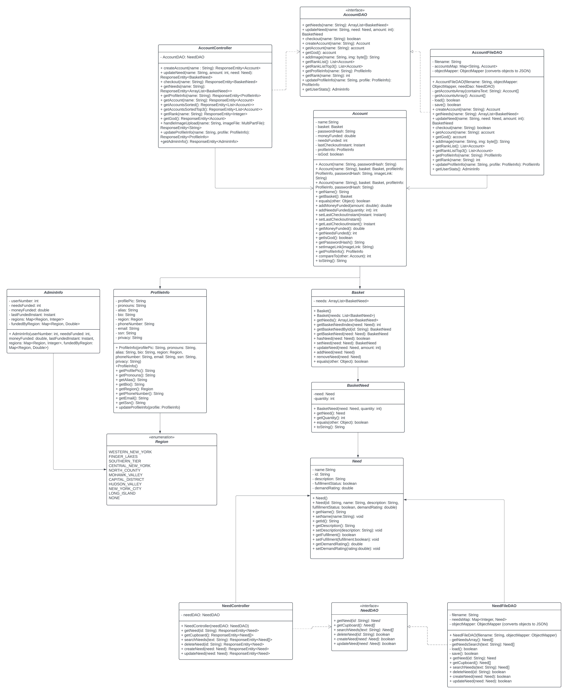

#### UML Breakdown
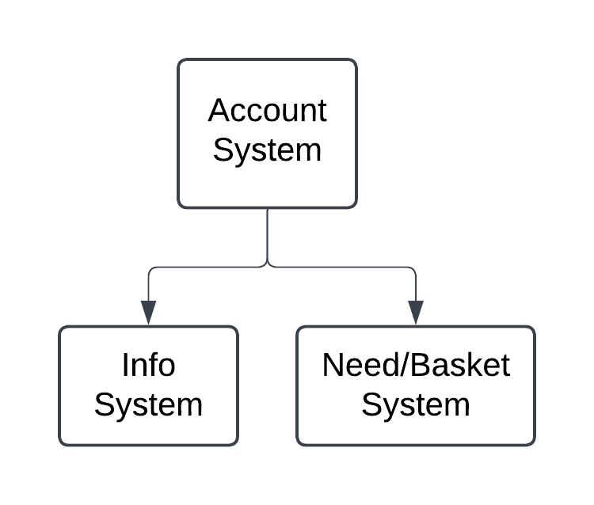
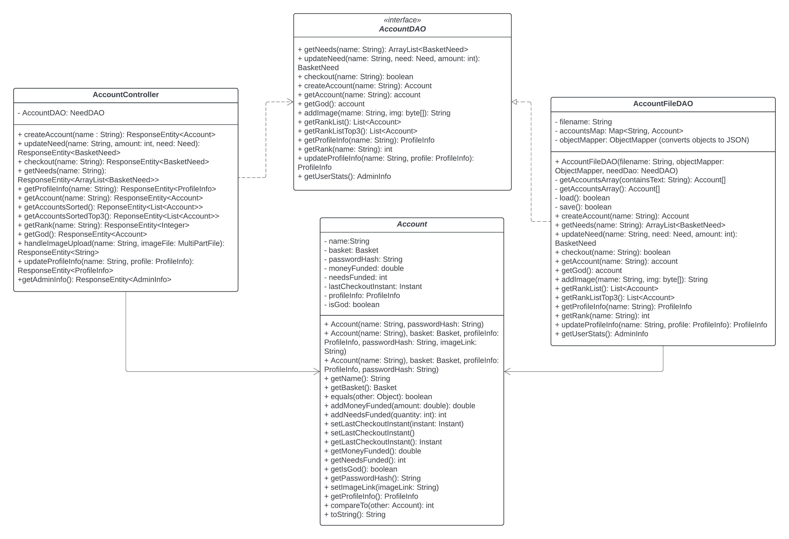
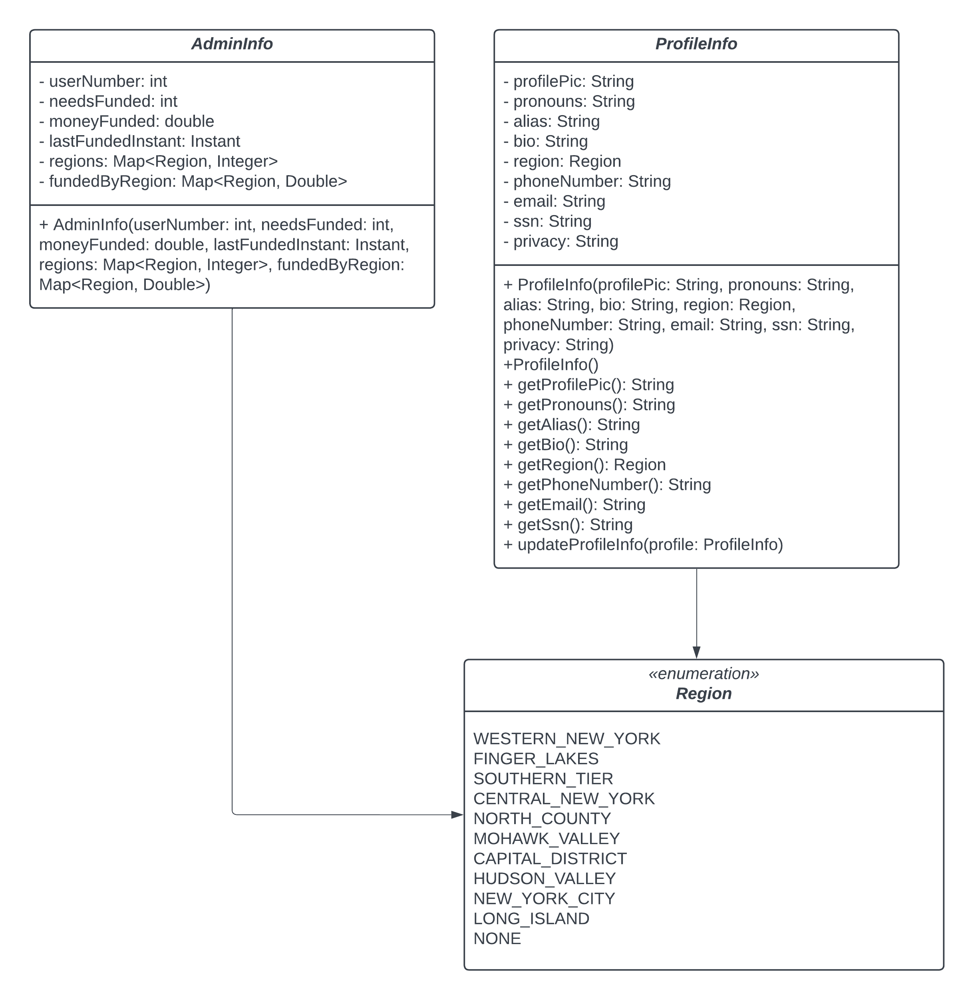
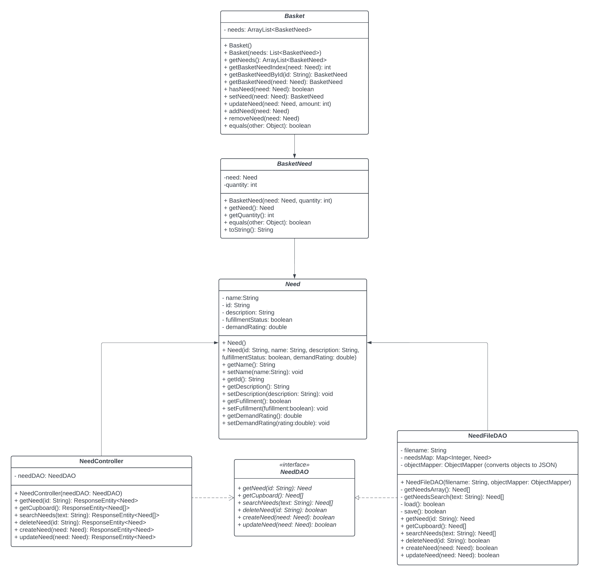

> _At appropriate places as part of this narrative provide **one** or more updated and **properly labeled**
> static models (UML class diagrams) with some details such as associations (connections) between classes, and critical attributes and methods. (**Be sure** to revisit the Static **UML Review Sheet** to ensure your class diagrams are using correct format and syntax.)_

## OO Design Principles

> **[Sprint 1]**

Single Responsibility: Each module should have one tightly focused responsibility.

Open-Close: When modifying a module, you should not make changes to existing logic, but rather consider keeping it and creating new logic instead. 

### The Single Responsibility
 A class is considered to comply with the single responsibility principle if there is one and only one reason for the class to change. One “thing” is not necessarily well defined, but it refers to one group of related behaviors and states. 
 
For example, each of our Java classes has a single function that it conforms to, and we've outlined those responsibilities below to showcase how each class remains independent to its purpose, and doesn't need to change based on other components. 
 
 The only class that potentially violates the Single Resposibility is the AccountDAO, which requires changes when either the Account process _or_ the basket-checkout proccess changes, as the checkout functionality requires both an Account basket and a Need cupboard. 

NeedController: Only responsible for updating and fetching needs

NeedDAO: Only responsible for DAO processes related to Needs

NeedFileDAO: Same as NeedDAO but specialized

Need: Only needs to be updated if the structure of a need changes

AccountController: Only responsible for creating, updating, and getting Accounts.

AccountDAO: Only responsible for DAO processes related to Accounts (**and** checking out need baskets)

AccountFileDAO: Same as AccountDAO but specialized

Account: Only needs to be updated in the struture of account changes 

Basket: Only needs to be updated in the structure of Basket changes 

BasketNeed: Only needs to be updated if the structure of BasketNeed changes 

### Open/Closed
A class should be open to expansion but closed to modification. Expansion means that different components can be used in a class but the behavior of the class does not change. A good example of this is the NeedDAO, which does not need to be modified to add more behavior. Instead, we inherit NeedDAO and create a new object (NeedFileDao) which is an extension. 

Our Need class does not comply with this principle. To add new behavior to a Need, we must change all the Needs within the Need database. For example, adding a "type" field to each Need would require us to migrate the entire database in order to preserve our data while supporting the new value of Need. We would also have to modify our methods and parsers for creating and testing Needs to support the new field. 

Open/Closed is useful for maintaining backwards compatibility. By not modifying existing code, you minimize the chance of breaking old code. Instead you can build new independent functionality on top of the existing code. While the old code can run with what is now a limited feature set, the new code, which depends on new features, is also able to run - removing the need to refactor large parts of code (which depends on the thing being changed) when adding features. 

### Dependency Inversion/Injection

The principle of Dependency Inversion states that high level modules should not rely on low level modules. Rather, there should be levels of abstraction between these two tiers. This allows for looser coupling within the program. A good example of Dependency Inversion is the Model, View, View-Model Architecture. There are multiple instances where we implement this architecture throughout our program:

AccountController -> AccountDAO -> AccountFileDAO -> Account and similarly,
NeedController -> NeedDAO -> NeedFileDAO -> Need

In both of these cases, the controller calls DAO methods, which is an abstraction of the concrete implementation FileDAO. The FileDAO calls model methods to alter instances of classes, and then saves those to our persistence system (A JSON file)

In both our controllers, the DAO abstractions are injected via the constructor. In many of our frontend modules, services and other modules are injected via the constructor as well.

### Pure Fabrication

The principle of Pure Fabrication involves creating modules that are not within the problem domain in order to make implementation, cleaner, more reusable, and more efficient. Pure Fabrication is an effective to way to solve problems that violate the Single Responsibility principle. That is, if you find yourself writing a module that does more than one significant thing, you should probably make a different module to handle whatever it is you're implementing. That way if there is any refactoring later down the line you only have to touch the module that is relevant to your problem. Below I will list some parts of our application which adhere to the Pure Fabrication principle. 

Our AccountFileDAO and NeedFileDAO are responsible for the storage and accessing of accounts and needs in our database, respectively. We did this so we could seperate runtime and persistence functionality- it would be messy to have one big class that held state, functions, and managed our storage system. 

We also used the Pure Fabrication principle in many places on our Front End. We found it was useful to seperate modules up and use them throughout the program. For example, we has a level service that was solely responsible for determining a user's rank. We also had an authorization service, which other components used, to verify a user was allowed to access a specific page. 

> _**[Sprint 2, 3 & 4]** Will eventually address upto **4 key OO Principles** in your final design. Follow guidance in augmenting those completed in previous Sprints as indicated to you by instructor. Be sure to include any diagrams (or clearly refer to ones elsewhere in your Tier sections above) to support your claims._

> _**[Sprint 3 & 4]** OO Design Principles should span across **all tiers.**_

## Static Code Analysis/Future Design Improvements
> _**[Sprint 4]** With the results from the Static Code Analysis exercise, 
> **Identify 3-4** areas within your code that have been flagged by the Static Code 
> Analysis Tool (SonarQube) and provide your analysis and recommendations.  
> Include any relevant screenshot(s) with each area._

> _**[Sprint 4]** Discuss **future** refactoring and other design improvements your team would explore if the team had additional time._
>
While we're overall quite happy with our current production code, running SonarQube highlighted a few potential areas for improvement as we continue the development process. The most significant of these are outlined below.

 1. Stacktrace printing in ProfileInfo.java. This line was added to be able to adequately handle the error that arises when an Illegal Access exception occurs, but printing the stack is not recommended for production code.
    
_Shown in Basket.java:_

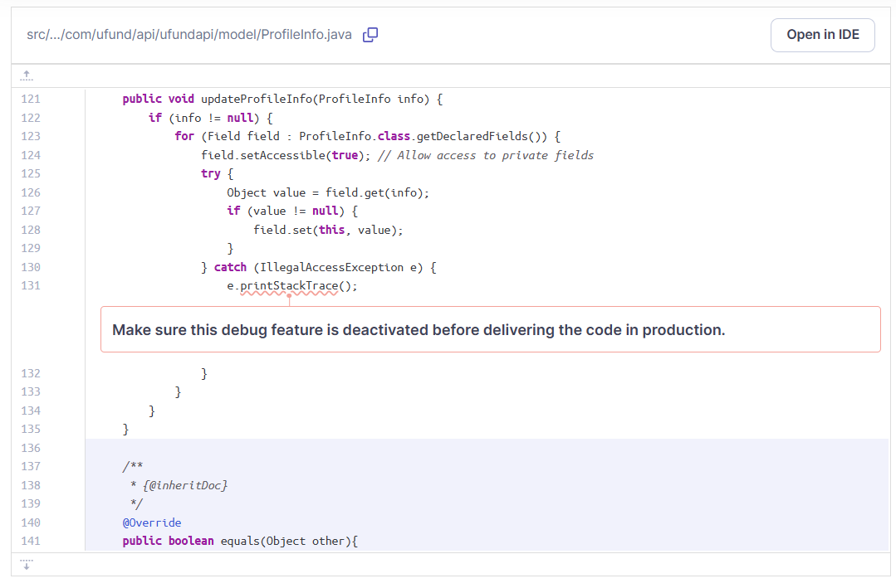

2. Override hashCode methods. When we created our Model objects, we implemented equals() methods for comparison. However, it’s recommended that all objects that would override an equals() also override hashCode() to support other types of comparisons, which may be relevant depending on potential model comparisons later in development.

_Example in Basket.java:_

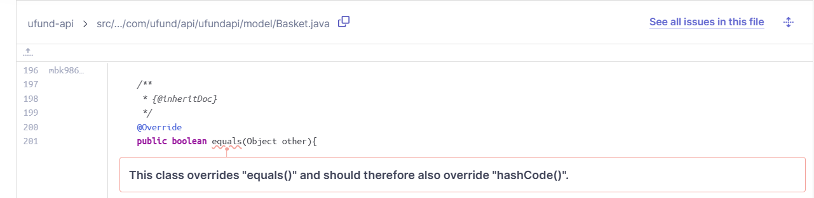

3. Random number gen for message ID. We’re using Typescript’s Math.random(), which is potentially nonrandom and was highlighted as a potential security error, but should be secure enough for our current use case. These IDs are only used for message display, not handling any secure user data.

_Shown in message.service.java:_

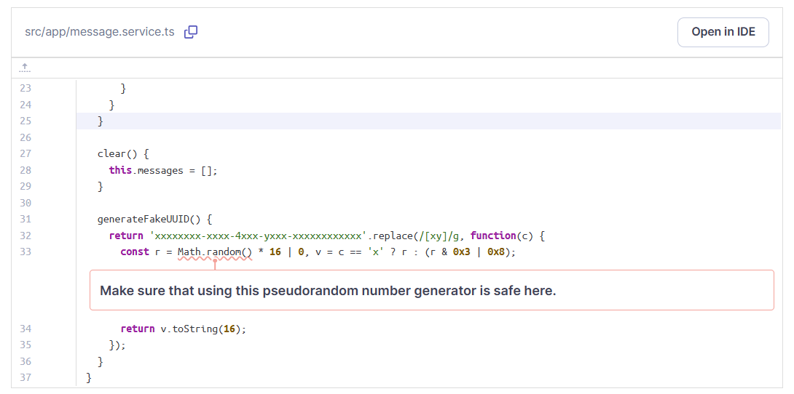

4. Accessibility: There are a few changes in our HTML code that would make it more accessible, such as adding `<alt>` tags for images and KeyboardPress alternatives for our Click events. These changes would make the website more accessible for users who can’t view images or who don't have access to a mouse or keypad.

## Testing
> _This section will provide information about the testing performed
> and the results of the testing._

### Acceptance Testing
> _**[Sprint 2 & 4]** Report on the number of user stories that have passed all their
> acceptance criteria tests, the number that have some acceptance
> criteria tests failing, and the number of user stories that
> have not had any testing yet. Highlight the issues found during
> acceptance testing and if there are any concerns._

When originally testing the acceptance criteria, we ran into a few problems with specific edge cases (For example, an admin deleting a need and that need staying in a helper's basket). So, we refined our implementation and tests and explored some more edge case tests (negative numbers of Needs, users checking out while the admin was changing Need values, confirmation popups, etc) to ensure the MVP was glitch-free. 

Then, after retesting our acceptance criteria, we reached 100% acceptance critera completion within our acceptance critera spreadsheet, which is where we now stand as of the current implementation.

### Unit Testing and Code Coverage
> _**[Sprint 4]** Discuss your unit testing strategy. Report on the code coverage
> achieved from unit testing of the code base. Discuss the team's
> coverage targets, why you selected those values, and how well your
> code coverage met your targets._

>_**[Sprint 2, 3 & 4]** **Include images of your code coverage report.** If there are any anomalies, discuss
> those._

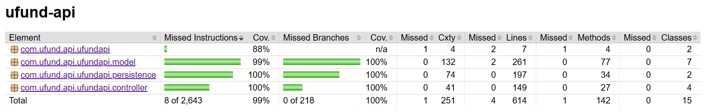
_Anomaly Note:_ The missing one percent in the model tier is a branch that catches an access error, given our current code structure it was evaluated to be a low-priority enough branch that no test was needed. The other missing coverage is the main method running the Spring application, which theoretically shouldn't ever fail.

## Ongoing Rationale
>_**[Sprint 1, 2, 3 & 4]** Throughout the project, provide a time stamp **(yyyy/mm/dd): Sprint # and description** of any _**major**_ team decisions or design milestones/changes and corresponding justification._
>
> **[Sprint 1] decisions**
> - (2024/10/1) Switched from integer IDs or unique names for Needs to String UUIDs. This change was agreed upon to simplify the backend logic and limit conflicts based on hidden backend information.
> - (2024/10/1) Decided to keep our DAO as Need/NeedFile rather than Cupboard, as the Cupboard name is a concept for the customer and holds no signficance to working with the Need classes on the backend.
>
>**[Sprint 2] decisions**
> - (2024/10/4) Need creation now fails with an error response if the numerical arguments (cost, quantity, demand) are less than 0. Given the realistic constraints of needs, those values should never be negative.
> - (2024/10/11) Updated UI to use icons instead of text for managing needs buttons
> - (2024/10/12) Renamed StorageService to AuthService for user authentication/login functionality
> - (2024/10/16) Refactored BasketNeed to have a Need and a quantity instead of a UUID and a quantity
> - (2024/10/20) Changed editing need in basket quantity to numerical input instead of increment/decrement methods
> - (2024/10/20) Needs are not allowed to be added to the basket if they would overflow the maximum available quantity. We're not sure if the Paws and Claws foundation has the space to store surplus, and we don't want it to go to waste. 
> - (2024/10/20) All Needs are auto-sorted by Demand rating in the UI
> - (2024/10/22) If two users both try to fund the same basket need at the same time and there's not enough to go around, the first one to fund the needs gets to fund them and the later person gets an error message.
>
> **[Sprint 3] decisions**
> - (2024/10/24) Refactored logout system. Previously, we were using local service variables to store authenticated usernames. However, on any page refresh/initialization these credentials were removed. The application now instead uses
> localStorage to store credentials so these persist across pages. This also allowed us to add an authentication guard to non-login pages, so indexing a route without authentication is cleaner.
> - (2024/10/30) Decided to create a ProfileInfo model to store an accounts profile information since these values are only ever changed by the user and aesthetic
> - (2024/10/31) Decided to use an md5 library to hash passwords so they are not stored in plaintext by our backend.
> - (2024/11/2) Using the Cloudinary API for creating and storing image links in the cloud for profile images. 
> - (2024/11/5) Determine rank first by moneyFunded, then use the number of needsFunded, then consider whoever made the most recent donation to be a better rank
> - (2024/11/5) Changed admin loggin functionality. Password is now required, and set to "adm1n!".
> - (2024/11/6) User level-up no longer requires an account age factor because the focus should be more on the amount of money funded than the amount of time it took for a user to do it
> - (2024/11/7) Leaderboard on home page only shows top three users, plus logged in user if not in top 3 users. If there is a u-fund god, they are displayed above the leaderboard.
> - (2024/11/7) Decided to make a new component for viewing a profile that is not yours. There is a route that leads to this component, and localstorage which tracks which profile you attempt to visit
> - (2024/11/8) Decided to do phone number and SNN formatting for profile info in angular rather than making the user do it so that they have an easier time updating their information
> - (2024/11/9) Added more specific password validation messages on the login screen
> - (2024/11/9) Added a new field to profileInfo, privacy, which determines whether other users can see your profile from the leaderboard component.
> - (2024/11/10) When you tie the moneyFunded for the Top 5% Index of funders, you become a Master as well, even if cut off by to 5% math
> - (2024/11/10) When progressing towards the next level, your percentage is never rounded up to 100%
> - (2024/11/10) The admin can see user demographic statistics, but they should also be able to see the leaderboard. We gave them a tabular dashboard page so that all three of these menus are avilable.
> - (2024/11/11) The CSS on the Dashboard is difficult enough that it's not going to be presented in the mobile version of the app; admins on mobile will see text reminding them that they can check out the desktop web app to view the descriptive statistics.
